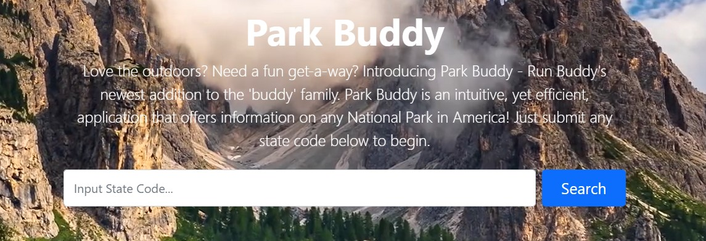

# Park Buddy

## Purpose
Park Buddy was our first project within the Berkely Coding Boot Camp. We were required to utilize two server-sided API's, implement 
them into our application, and create a website that both accepts user input to create an unique output. The main functionality of the website
is to reccomend any national park in the US by state code while also providing a brief description, contact information, and a map. The is map
is fully functional, pinpoints the user's clicked park and allows them to control the viewport. Overall, the project was a great learning 
process that allowed our team to dive into bootstrap, javascript, and APIs.

## Build With
- HTML
- CSS
- JavaScript
- Bootstrap
- Jquery 
- National Park Service API
- OpenLayers API

## Website
https://magoofy.github.io/project-1/

## Contribution

Jolo Cabrera, Afi Akau, Steven Chai, and Nick Kanno
